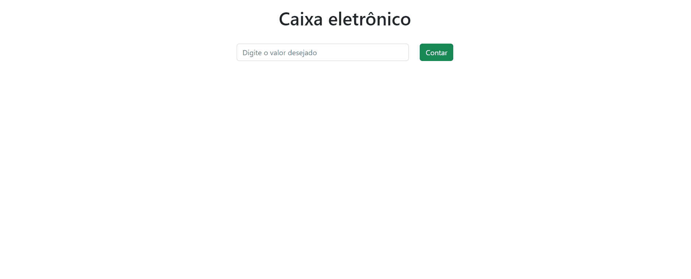

<h1>Sistema de Caixa Eletrônico</h1>
<br/>


<h3>
    Esse projeto tem como funcionalidade principal, receber um valor inteiro e devolver o menor número de cédulas que compoem o valor digitado.   
</h3>
<br/>
<br/>

<h1>Pré-requisitos</h1>
<h3>
    Para poder rodar este projeto você vai precisar das seguinte ferramenta instalada <a href="https://nodejs.org/en/">Node js</a>,
    após a instalação da ferramenta siga os passos a seguir.
</h3>
<br/>

```bash
#clone este repositorio
git clone https://github.com/user/repositorio.git

#acesse a pasta do repositório pelo terminal

cd caixaEletronico

#instalando dependencias
npm install

#execute a aplicação

npm start

```
<br/>
<br/>

<h1>
    Ilustração do projeto
</h1>
<br/>


<br/>
<br/>

<h1>Tecnologias</h1>

<ul>
    <li>JavaScript</li>
    <li> <a href="https://pt-br.reactjs.org/">React js</a></li>
    <li> <a href="https://reactstrap.github.io/?path=/story/home-installation--page">ReactStrap</a> </li>

</ul>


